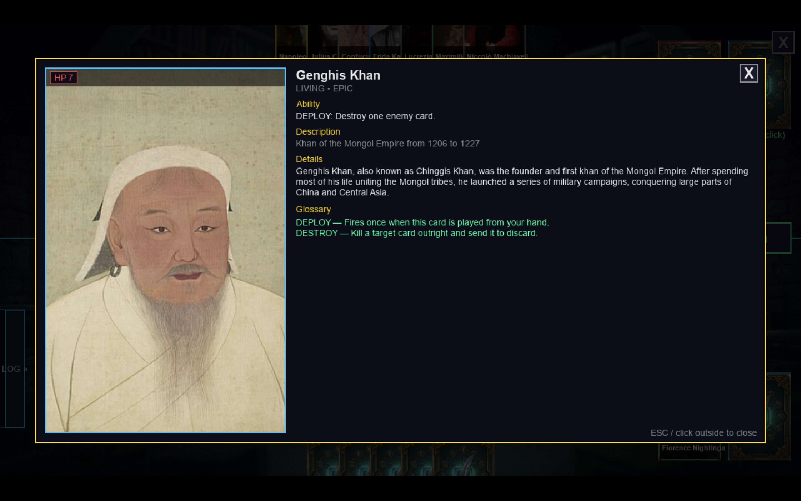
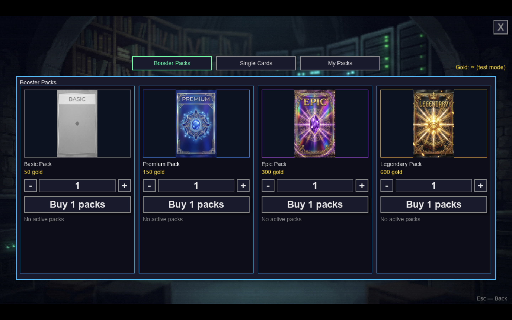
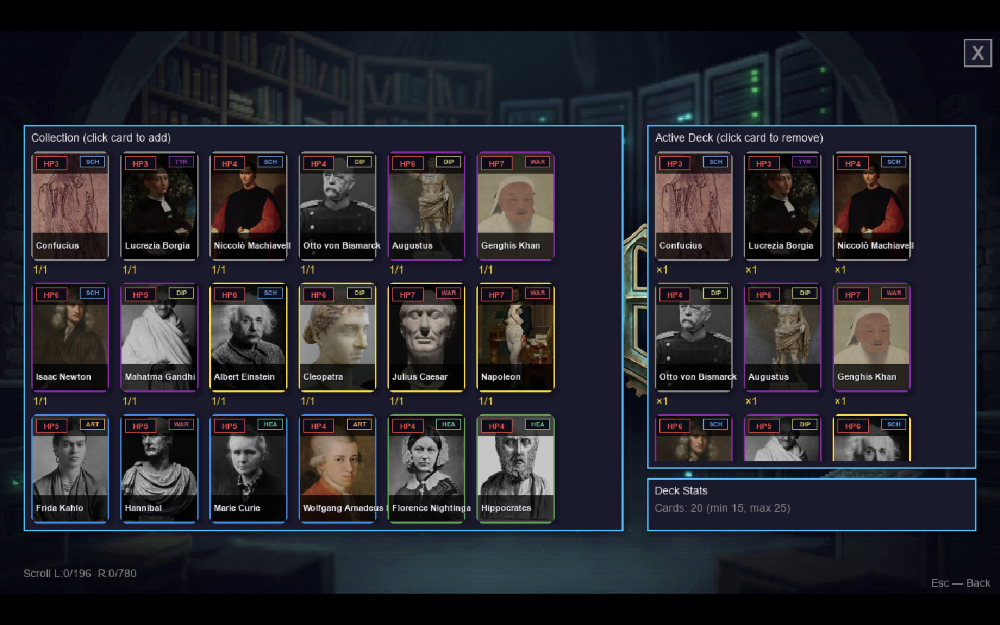

# WikiDeck

> A PvP collectible card game where every card is a real person from Wikipedia — and the game decides how powerful they are by counting how many people read about them.


Built with Python + Pygame + Ollama for CS 108 — Walla Walla University, Spring 2026.

---

## The idea

Most card games invent their own fictional universe and you have to learn it. WikiDeck doesn't. **Every card is a real Wikipedia article** about a historical personality, and its game stats come from real-world signals:

- **Rarity** is decided by monthly Wikipedia pageviews — Einstein has 1.2M views/month, so he's Legendary; an obscure 13th-century scribe is Common.
- **Archetype** (Warrior / Tyrant / Healer / Scholar / Artist / Diplomat) is decided by Wikipedia's own short description of the person — "American physicist" → Scholar, "Roman general" → Warrior.
- **Ability text** is written by a local LLM (Ollama) grounded in the article summary, then validated against a strict contract.

You build a deck, play 1v1 — hotseat on one keyboard or over WebSockets across the LAN — and try to outlast your opponent.

---

## Demo

### A match in progress
Drag from hand to the field to play, right-click to discard. Hover any card to see its ability, full Wikipedia extract, and the in-game glossary for any term you don't recognise.


### Every card is a Wikipedia article
Right-click any card to open the detail panel — the Wikipedia subtitle, the article extract, and an auto-generated glossary of every game term in that card's ability.



### Booster shop — four tiers, generated on demand
Pack contents are not pre-rolled. When you click *Buy*, the generator runs in a background thread: it walks the pool of 1000+ historical personalities, biases away from over-represented effects, calls Ollama for each ability, and lands a balanced pack of 5.



### Deck builder
Click any card on the left to add it, click on the right to remove. Min/max validation is live, and the screen refreshes as soon as cards are bought.



---

## Tech stack

- **Python 3.11+** + **pygame-ce** — game client and rendering
- **Ollama** (local LLM, default model `qwen2.5-coder:14b`) — ability text + biographical flavor
- **Wikipedia REST API** — article summaries, pageviews, images
- **SQLite** — local cache for articles, cards, collection, decks, settings, shop state
- **websockets** — authoritative server + client for 1v1 LAN play
- **PIL** — image decoding fallback when pygame can't read a format

## Quick start

```bash
pip3 install -r requirements.txt
python3 main.py
```

Optional — point at a remote Ollama instance:
```bash
export WIKIDECK_OLLAMA_HOST=http://your.host:11434
```

Without Ollama the game still runs — it falls back to a template ability generator. Cards still get balanced effects and archetypes, just without LLM-written flavor lines.

---

## How it works

```
                 ┌─────────────────────────────────────────┐
                 │             Wikipedia REST API          │
                 │   summaries · pageviews · article media │
                 └────────────┬────────────────────────────┘
                              │
        ┌─────────────────────▼─────────────────────┐
        │   data/ollama_gen_v2.py   (card generator) │
        │   ┌─────────────────────────────────────┐  │
        │   │  pool → person check → pageviews    │  │
        │   │       → rarity → archetype          │  │
        │   │       → effect (weighted+biased)    │  │
        │   │       → trigger (compat-filtered)   │  │
        │   │       → Ollama LLM (ability+flavor) │  │
        │   │       → contract validation         │  │
        │   │       → balance pass → save         │  │
        │   └─────────────────────────────────────┘  │
        └─────────┬─────────────────────────────────┘
                  │
        ┌─────────▼───────────┐      ┌──────────────────────┐
        │   SQLite + PNG       │     │   pygame UI          │
        │   wikideck.db        │◄────│   menu · match · shop│
        │   card_images/*.png  │     │   deck builder · etc.│
        └──────────────────────┘     └──────────┬───────────┘
                                                 │
                                                 │ (optional)
                                  ┌──────────────▼───────────┐
                                  │   websockets server      │
                                  │   1v1 LAN match          │
                                  └──────────────────────────┘
```

### Two systems I'm proud of

1. **Wikipedia-driven rarity.** [`assign_rarity_by_views()`](data/ollama_gen_v2.py) is 11 lines and is the whole concept of the game — the world decides which historical figures are rare, not me. Einstein gets Legendary because he gets a million views a month.

2. **Two-layer balanced picker.** [`_weighted_pick()`](data/ollama_gen_v2.py) biases card generation away from over-represented effects both *within the current pack of 5* and *across the entire database*. Run [`python3 -m tools.balance_report`](tools/balance_report.py) to see the live distribution as an ASCII chart.

---

## Project layout

```
WikiDeck/
├── main.py                     — entry point (state-machine loop over screens)
├── config.py                   — constants: colors, sizes, paths, Ollama config
│
├── core/                       — game engine (no UI dependency)
│   ├── card.py                 — Card dataclass + per-frame rendering
│   ├── card_factory.py         — build Card from cached spec + Wikipedia
│   ├── effects.py              — 17 ability effects (damage/heal/poison/lock/etc.)
│   ├── game_state.py           — match controller (phases, targeting, kills)
│   ├── player.py               — deck/hand/field/discard zones
│   ├── triggers.py             — DEPLOY/DEATHWISH/ORDER/TIMER/... dispatch
│   ├── icons.py                — status & trigger icon loader
│   └── sound_player.py         — pygame.mixer wrapper, hot-reloads settings
│
├── data/                       — storage + Wikipedia + LLM
│   ├── db.py                   — SQLite cache (articles, cards, decks, shop)
│   ├── wikipedia.py            — REST client with retry/backoff
│   ├── ollama_gen_v2.py        — full card-generation pipeline (1.8k lines)
│   ├── card_contract.py        — strict validation of LLM output
│   ├── booster.py              — shop: packs + singles, async generation
│   ├── historical_people_pool.py — 1000 curated Wikipedia titles
│   ├── settings_schema.py      — typed settings definitions
│   └── settings_service.py     — SQLite-backed runtime settings
│
├── network/                    — multiplayer (WebSockets)
│   ├── server.py               — authoritative match server
│   ├── client.py               — async client running in its own thread
│   ├── protocol.py             — message types (JSON)
│   └── sync.py                 — serialize / hydrate GameState
│
├── ui/                         — rendering
│   ├── screens/                — main_menu · play · match · shop · settings · …
│   ├── components/hover_panel.py — large card tooltip with glossary
│   ├── particles.py            — particle/shockwave/lightning systems
│   ├── effects.py              — glow, drop shadow, easing
│   └── hud_utils.py            — player panels, turn indicator, score
│
├── tools/
│   ├── balance_report.py       — CLI: ASCII chart of effect/trigger/archetype mix
│   └── demo_deck.py            — install a curated 20-card deck for showcase
│
└── assets/                     — audio + status/trigger icons
    ui/assets/                  — backgrounds, logo, pack art, card image cache
```

---

## Features

- ✅ Hotseat 1v1 on one keyboard (P1 bottom, P2 top)
- ✅ LAN 1v1 over WebSockets (host + join via IP)
- ✅ 17 ability effects with targeting, status stacks, ORDER once-per-game, TIMER countdown, BLOODTHIRST / ADRENALINE conditional triggers
- ✅ Booster shop (4 pack tiers) + single-card storefront, all generated on demand
- ✅ Collection + deck builder with min/max validation
- ✅ Full settings menu (7 categories) persisted in SQLite
- ✅ AI-generated ability text + biographical flavor, with template fallback if Ollama is offline
- ✅ Live balance report tool (`python3 -m tools.balance_report`)
- ✅ Showcase-ready demo deck installer (`python3 -m tools.demo_deck`)
- ⚠️ Network mode has no auth/encryption — LAN only
- ⚠️ Profile screen is a placeholder (XP/Level coming later)

---

## Status

Final showcase build — CS 108, Walla Walla University, June 2026. Active development; everything subject to change.

## Author

Mark Khanchevskii — [github.com/markkhanchevskii](https://github.com/markkhanchevskii)
